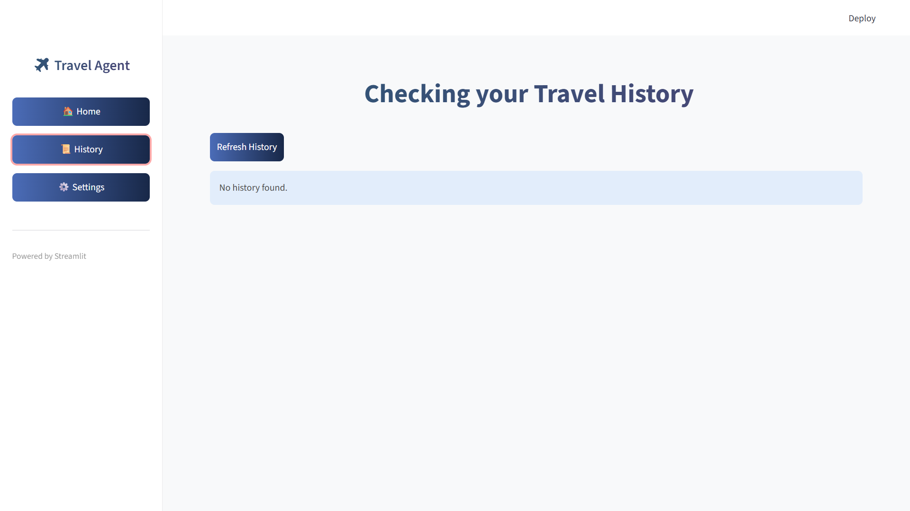
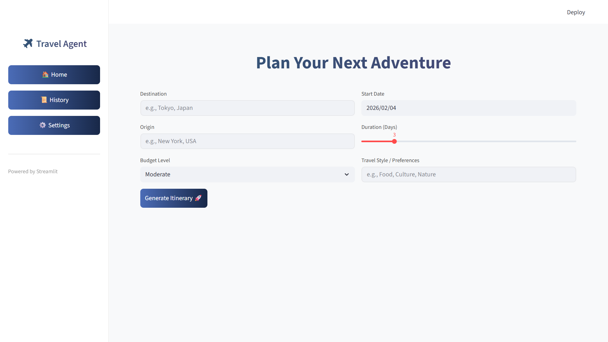
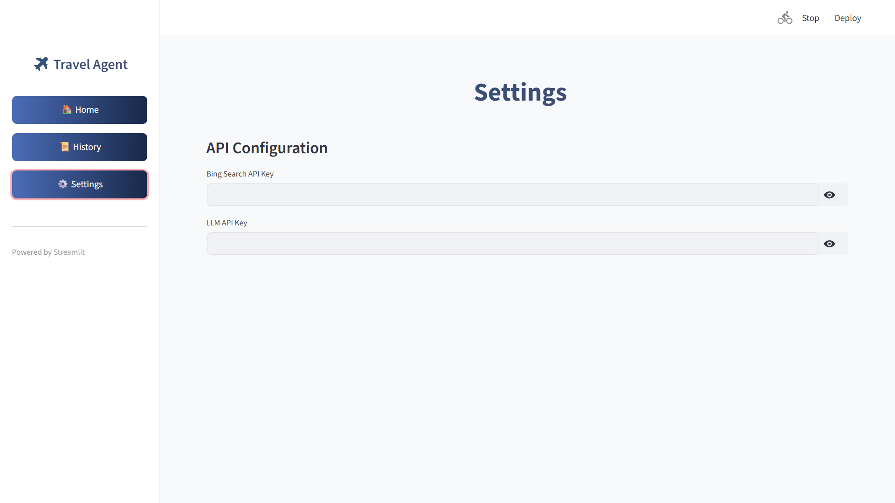

# ✈️ Intelligent Travel Planning Assistant

An AI-powered travel planning application that generates personalized itineraries and beautiful daily posters based on user input including destination, budget, travel preferences, and more.

## 🌟 Key Features

- 🗺️ **Personalized Itinerary Planning**: Generate detailed daily schedules based on user-provided destination, origin, budget, and travel preferences
- 🎨 **Auto-generated Posters**: Create beautiful poster images for each day of the trip
- 📊 **Multi-page Web App**: User-friendly interface built with Streamlit, including Home, History, and Settings pages
- 🔍 **Smart Search**: Integrates with Bing Search API to get real-time travel information
- 📝 **History Tracking**: Saves user's travel planning history

## 📸 Application Screenshots

### Home Page


### Generated Itinerary


### Settings Page


### Generated Poster Examples

#### Day 1


#### Day 2


#### Day 3


## 🚀 Quick Start

### Prerequisites

- Python 3.8+
- Streamlit
- Flask
- LangChain

### Installation Steps

1. **Clone the Repository**
```bash
git clone <repository-url>
cd Travel_upload
```

2. **Install Backend Dependencies**
```bash
cd backbond_python
pip install -r requirements.txt
```

3. **Install Frontend Dependencies**
```bash
cd ../web_app
pip install -r requirements.txt
```

4. **Configure API Keys**

Create a `.env` file in the `backbond_python` directory and add the following content:
```env
BING_SEARCH_API_KEY=your-bing-search-api-key
LLM_API_KEY=your-llm-api-key
LLM_MODEL_NAME=your-model-name
```

5. **Start Backend Service**
```bash
cd backbond_python
python app.py
```

6. **Start Frontend Application**
```bash
cd web_app
streamlit run streamlit_app.py
```

## 📁 Project Structure

```
Travel_upload/
├── backbond_python/          # Backend service
│   ├── roleplay/             # Prompt templates
│   ├── utils/                # Utility functions
│   ├── agent.py              # AI agent
│   ├── app.py                # Flask backend
│   ├── config.py             # Configuration file
│   ├── generate_daily_posters.py  # Poster generation
│   ├── route_generate.py     # Itinerary generation
│   └── requirements.txt      # Backend dependencies
├── web_app/                  # Frontend application
│   ├── streamlit_app.py      # Streamlit main app
│   ├── styles.css            # Custom styles
│   └── utils.py              # Frontend utilities
├── posters/                  # Generated posters
├── README.md                 # Chinese documentation
└── README_EN.md              # English documentation
```

## 🛠️ Technology Stack

- **Frontend**: Streamlit, Python
- **Backend**: Flask, Python
- **LLM**: LangChain, OpenAI/other LLM providers
- **Image Processing**: Pillow
- **Search**: Bing Search API

## 📝 Usage Instructions

1. Enter destination, origin, budget, travel dates, and preferences on the home page
2. Click the "Generate Itinerary 🚀" button
3. Wait for the system to generate the itinerary (may take 1-2 minutes)
4. View the detailed itinerary and daily posters
5. Check previously generated itineraries in the History page

## 📄 License

MIT License

---

[中文版本](README.md)